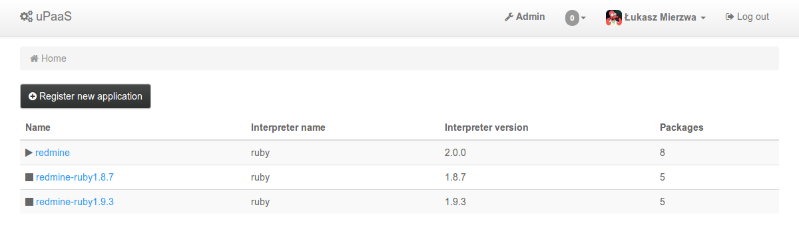
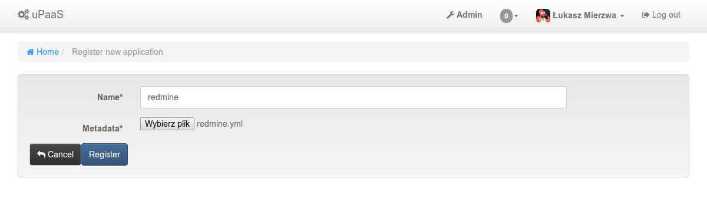
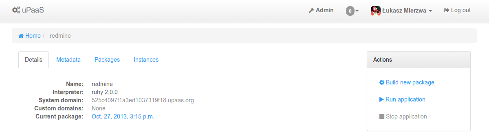
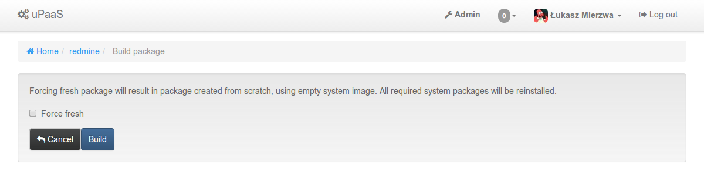
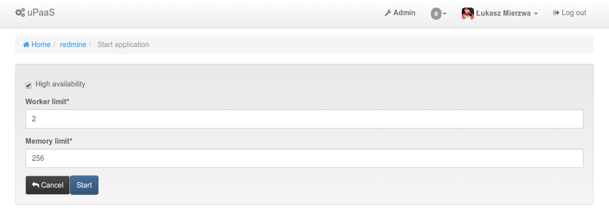
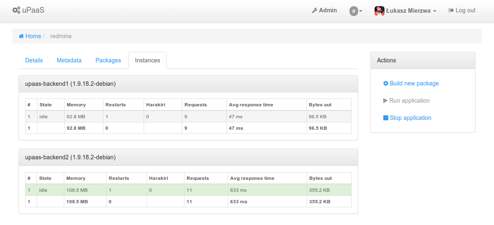
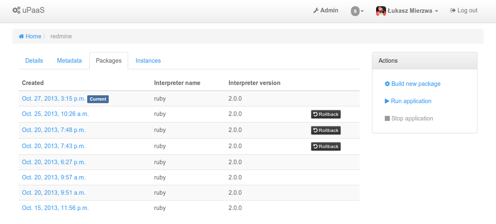
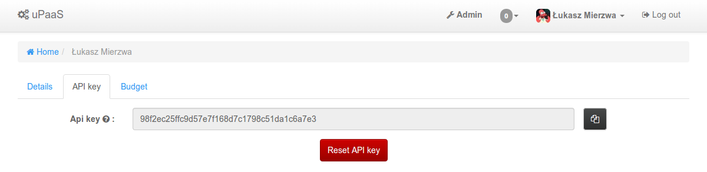

Web UI walkthrough
==================

Index
-----

Main page is your application list, icons on the left are showing if the application is stopped or running.

Registering new application
---------------------------

To register new application you need to provide unique application name and valid metadata file.

Application details view
------------------------

Building packages
-----------------

Once application is registered we can try building package for it by cliking on "Build new package" from actions bar.

Starting application
--------------------

After successfully building package for our application we can start in by selecting "Run application" from actions bar.
Enabling high availability will cause uPaaS to start application on multiple backends at once.

Inspecting running application
------------------------------

"Instances" tab show all running instances of our application.

Package list
------------

Package list allows us to check all packages built for our application and to rollback if needed.
Rollback allows us to run our application using previously built package instead of current one, for example when critical bug is introduced in latest code and we want to switch back to older package as soon as possible, without waiting for new patched package to be build.
Only few latests package files are kept so it's not possible to rollback to any package.

User Account
------------

There are two important tabs in user account view.
First one will show API key that is needed to manage uPaaS application using CLI client app.

Second shows user budget.

.. image:: static/img/account_budget.png
